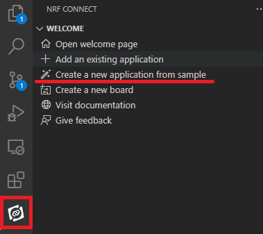
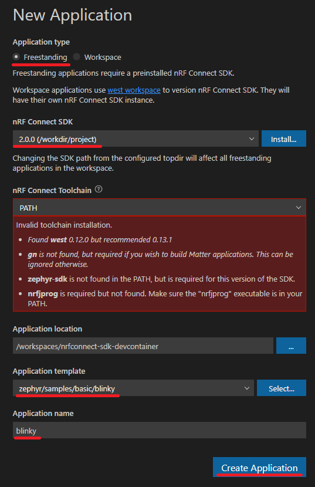
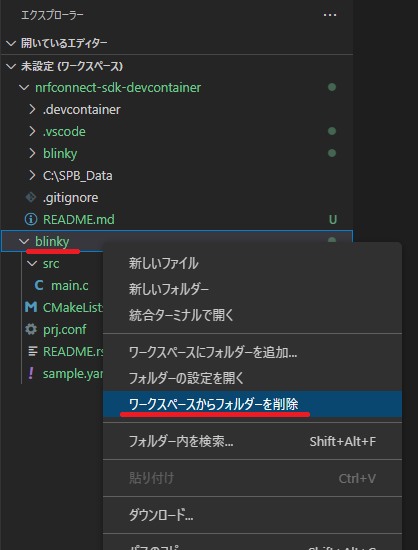
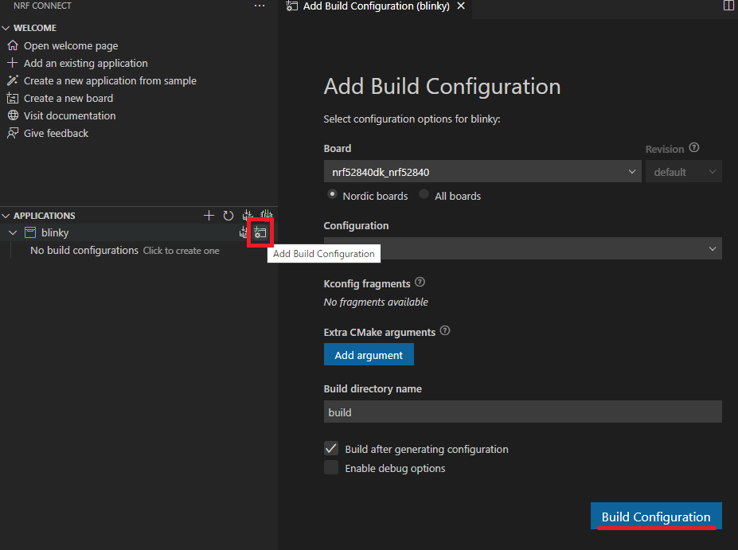

# VS Code Remote / GitHub Codespaces Container for nRF Connect SDK

## Included SDKs and Tools

| SDK / Tool | Location |
| :--- | :--- |
| [Zephyr RTOS meta tool (west)](https://pypi.org/project/west/) |
| [nRF Command Line Tools](https://www.nordicsemi.com/Products/Development-tools/nrf-command-line-tools/) |
| [Zephyr SDK](https://github.com/zephyrproject-rtos/sdk-ng) | /workdir/zephyr-sdk |
| [nRF Connect SDK](https://github.com/nrfconnect/sdk-nrf) | /workdir/project |
| [nRF Connect Visual Studio Code Extension Pack](https://marketplace.visualstudio.com/items?itemName=nordic-semiconductor.nrf-connect-extension-pack) | VS Code |
| [C/C++ for Visual Studio Code](https://marketplace.visualstudio.com/items?itemName=ms-vscode.cpptools) | VS Code |
| [Cortex Debug](https://marketplace.visualstudio.com/items?itemName=marus25.cortex-debug) | VS Code |

## Blinky

1. Click **Create a new application from sample** in NRF CONNECT window.  

2. Enter some required information and click **Create Application** button.  

3. Remove **blinky** folder from workspace.  

4. Click **Add Build Configuration** button and click **Build Configuration** button.  

## Links

* [Docker image for building nRF Connect SDK applications](https://github.com/NordicPlayground/nrf-docker)
